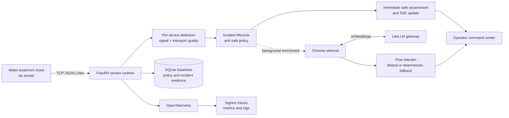

# Industrial IoT Anomaly Control

> An evidence-first industrial diagnosis system that detects equipment faults, retrieves verified precedents, explains safe maintenance actions, and abstains when the evidence is weak.

Industrial plants already generate continuous vibration, temperature, humidity, and transport telemetry. Conventional threshold alarms can say that a value is high, but they rarely explain why it matters. The result is alarm fatigue, missed failures, and maintenance decisions made without enough context.

Industrial IoT Anomaly Control is designed to turn that raw stream into a traceable operational decision. It combines deterministic detection, historical-incident retrieval, application-owned confidence policy, bounded AI explanation, human review, and end-to-end observability. The system recommends action only when verified evidence is strong enough; otherwise, it explicitly escalates instead of guessing.

## Final product architecture



The LLM does not decide whether maintenance should be recommended. It refines an already-safe assessment after the detector-only incident is visible, and cannot override policy, data-quality gates, or recovery rules.

## What the finished system does

1. Streams realistic telemetry from six named assets in a water-treatment plant.
2. Validates event identity, sequence, timestamps, schema, and channel values at ingestion.
3. Detects vibration spikes, gradual drift, dropouts, and transport-quality failures using independent per-device state.
4. Groups related detector evidence into one incident instead of flooding operators with repeated alarms.
5. Retrieves only relevant historical incidents after filtering by equipment, sensor type, and incident category.
6. Calculates confidence from anomaly strength, detector agreement, retrieval similarity and margin, precedent verification, persistence, and data quality.
7. Produces a safe detector-only assessment immediately, then enriches the same incident with a filtered Chroma match and optional bounded Mistral explanation.
8. Retains the knowledge trace until retrieval finishes, then automatically resolves an equipment software incident only after five consecutive healthy readings and an 8-second stable-normal observation window; data-quality incidents resolve after a quiet period.
9. Traces the pipeline through OpenTelemetry and SigNoz, including detector activity, retrieval, agent latency, fallback provenance, and recovery time.
10. Records operator findings so confirmed resolutions can improve local knowledge for future retrieval.

## Three safe outcome paths

### 1. Verified precedent → maintenance recommendation

A raw-water intake pump begins developing a bearing-misalignment signature. The detectors identify persistent vibration drift and supporting spike evidence, and the incident service correlates those events into one equipment-condition investigation.

Retrieval finds the strong, verified `WT-INC-001` water-treatment precedent. The similarity, match margin, detector agreement, data quality, and precedent status satisfy policy. The system recommends a bounded inspection action, cites the supporting incident, and generates a concise operator explanation.

### 2. Weak or novel evidence → human escalation

An asset produces a genuine anomaly, but the knowledge base has no sufficiently similar verified precedent—or the top matches are ambiguous. The system does not ask the model to invent a cause.

Policy returns `ESCALATE`, records reason codes such as `NO_MATCHING_PRECEDENT`, `LOW_RETRIEVAL_SIMILARITY`, `AMBIGUOUS_MATCHES`, or `UNVERIFIED_PRECEDENT`, and places the incident in the human-review queue.

### 3. Poor stream evidence → data-quality alert

Missing readings, duplicate event IDs, sequence gaps, timestamp regressions, stale messages, or gateway failures create a `DATA_QUALITY` incident. The system recommends inspection of the sensor, publisher, gateway, network, or ingestion path—not a mechanical repair.

Data-quality incidents can never become equipment recommendations merely because their messages look abnormal.

## Water-treatment demonstration fleet

| Stream ID | Asset | Equipment | Plant area |
| --- | --- | --- | --- |
| `sensor-1` | `P-101` | Raw Water Intake Pump | Intake Station |
| `sensor-2` | `B-201` | Aeration Blower | Biological Treatment |
| `sensor-3` | `M-301` | Flash Mixer | Coagulation Basin |
| `sensor-4` | `C-401` | Sludge Dewatering Centrifuge | Solids Handling |
| `sensor-5` | `P-501` | Chemical Dosing Pump | Chemical Room |
| `sensor-6` | `SC-601` | Sludge Screw Conveyor | Dewatering Area |

Every reading carries the stream identity, asset tag, equipment name and type, plant area, sequence and event identity, timestamp, temperature, humidity, and vibration.

## Simulator modes

Operators manage two plant modes rather than hand-authoring individual fault scenarios:

| Mode | Behavior |
| --- | --- |
| `normal` | All six assets continuously emit healthy telemetry with natural measurement noise |
| `faulty` | Demo-ready workload: 60 seconds of clean baseline, then a shuffled knowledge-backed equipment incident every 60 seconds (40-second duration); short data-quality anomalies begin at 180 seconds and then recur every 30 seconds |

Faulty mode cycles through all six water-treatment knowledge scenarios before repeating. It also injects duplicate events, sequence gaps, and intermittent readings independently, so traces show detector, retrieval, agent, and recovery behaviour under sustained load. Unaffected assets continue operating normally.

Using the same `--seed` reproduces scheduling and telemetry decisions. Playback speed can change through `--interval` without changing the reading-based fault schedule.

## Evidence and decision ownership

| Layer | Responsibility |
| --- | --- |
| Simulator | Emit realistic telemetry and delivery behavior; never create incidents directly |
| Ingestion | Parse and validate readings, reconnect safely, and reject malformed input |
| Detectors | Identify observable signal anomalies and transport-quality failures |
| Incident service | Correlate events, maintain lifecycle, and prevent alert floods |
| Retrieval | Return relevant historical precedents with scores and verification metadata |
| Confidence policy | Own `MONITOR`, `RECOMMEND`, `ESCALATE`, and `DATA_QUALITY_ALERT` decisions |
| LLM explanation | Explain an approved decision using bounded evidence; never override policy |
| Human review | Confirm, correct, or resolve uncertain outcomes |
| SigNoz | Make every stage inspectable through traces, metrics, logs, dashboards, and alerts |

The final confidence calculation combines:

- anomaly strength and persistence;
- detector agreement;
- input data quality;
- top retrieval similarity;
- separation between the first and second retrieval matches;
- verified-precedent status;
- configured recommendation and abstention thresholds.

The critical invariant is:

```python
assert not (decision == "RECOMMEND" and confidence < configured_threshold)
```

The application enforces that invariant before an explanation or notification is dispatched.

## Operator command center

The live dashboard provides:

- a three-rail command center: fleet, selected evidence, and Flow Warden;
- live readings, freshness, baseline comparison, detector state, and bounded trends;
- a transparent Flow Warden trace: observation, detector evidence, knowledge match, assessment, and recovery watch;
- a service rack for stream, detector, incident, Chroma, agent, policy, and SigNoz state;
- a completed-workflow handoff for an operator to save the actual maintenance finding;
- runtime policy controls persisted to SQLite;
- an activity timeline for detector, incident, review, policy, and stream events.

When the agent confirms recovery, the active scenario and retrieval evidence clear
from Flow Warden so the next investigation starts cleanly. The completed record
remains in activity/history and may still receive an operator report.

Normal telemetry remains ephemeral. The final system persists only operationally meaningful records: incidents, evidence, selected precedents, decisions, explanations, traces, review actions, and confirmed outcomes.

## Observability and safety

Every sensor reading produces a `sensor.process` trace. An anomalous reading
adds detector and policy spans immediately; knowledge enrichment then runs in a
background task so a slow embedding or model request cannot pause ingestion.

```text
sensor.process
├── detectors.evaluate
├── incident.evaluate
│   └── policy.evaluate                  detector-only safe decision
├── knowledge.enrich_incident            background task
│   ├── knowledge.retrieve
│   └── policy.re_evaluate
├── agent.explain                        Mistral or deterministic fallback
└── agent.monitor_recovery               retrieval complete + stable normal → resolved
```

Trace attributes connect the equipment, incident, detectors, retrieval result,
policy decision, agent provenance, and recovery state. Raw readings, prompts,
Mistral keys, and operator notes are not emitted to telemetry.

The included SigNoz runbook builds the **Water Treatment Agent — Trust &
Recovery** dashboard: telemetry throughput, detector activity, knowledge
grounding, agent latency, safe auto-resolutions, and incident recovery time.

## Final API and contracts

The finished API builds on the current REST and SSE surface with investigation intelligence and human review.

| Area | Final capability |
| --- | --- |
| Fleet | Live fleet snapshot, selected asset detail, trends, freshness, and stream status |
| Incidents | Filtered history, detector evidence, lifecycle, acknowledgement, and resolution |
| Investigations | Retrieved precedents, confidence breakdown, final decision, reason codes, and explanation |
| Human review | Review queue, assignment, outcome, correction, and verified resolution |
| Policy | Versioned detector, retrieval, confidence, abstention, and notification settings |
| Observability | Trace identifiers and links attached to investigations and decisions |
| Live updates | SSE events for readings, incidents, investigations, policy, reviews, and stream health |

The currently implemented routes are listed in [Current runnable system](#current-runnable-system).

## Example sensor reading

```json
{
  "event_id": "sensor-1-evt-000123",
  "sequence_number": 123,
  "device_id": "sensor-1",
  "asset_id": "P-101",
  "equipment_name": "Raw Water Intake Pump",
  "equipment_type": "centrifugal_pump",
  "area": "Intake Station",
  "sensor_type": "vibration",
  "unit": "mm/s",
  "timestamp": 1784678400.123,
  "temperature": 24.18,
  "humidity": 61.72,
  "vibration": 0.31,
  "fault_type": null,
  "fault_active": false,
  "duplicate": false
}
```

`fault_type`, `fault_active`, and `duplicate` are simulator evaluation metadata. Detection and decision code uses only observable telemetry and delivery behavior.

## Current runnable system

The repository contains streaming, detection, a per-sensor monitoring agent, source-backed Chroma retrieval, safe policy, SQLite state, API, and a live dashboard. The agent opens on an anomaly, explains the available evidence, watches every subsequent reading, and automatically resolves the software incident only after retrieval completes, five healthy readings arrive, and normal telemetry remains stable for the configured observation window. Operators only report what they found and how they fixed it; confirmed reports are saved as clearly labelled local knowledge and never override verified evidence or runtime policy.

The agent is modular and custom-built: it exposes three read-only tools (`get_incident_context`, `get_retrieved_precedents`, and `get_recovery_status`) to a bounded Mistral explanation call through LiteLLM. If the model or gateway is unavailable, it produces the same safe deterministic assessment instead of blocking the sensor pipeline.

The faulty simulator and retrieval corpus are strictly aligned to six water-treatment assets and their generated fault patterns. The corpus is a curated simulation scenario catalog for this demonstration, not a claim of real external incident history.

### Requirements

- [uv](https://docs.astral.sh/uv/) with project-managed Python 3.13+
- [Bun](https://bun.sh/) for the React dashboard
- A Mistral API key for embeddings and optional Flow Warden explanations
- Docker and SigNoz Foundry only when running the optional observability stack

Use `uv run` for Python commands so a matching global pyenv interpreter is not required.

Install project dependencies:

```bash
uv sync --dev
cd dashboard
bun install
cd ..
```

Create `.env` from the example and set `MISTRAL_API_KEY` and
`LITELLM_MASTER_KEY`. The application uses the LiteLLM master key as its local
gateway key; do not place the Mistral key in frontend code.

```bash
cp .env.example .env
```

### Full local demo

Run these terminals in order from the repository root. The API keeps the live
reading path responsive: Chroma retrieval and Mistral refinement occur after
the initial safe incident has already reached the dashboard.

```bash
# One-time: install the local OpenAI-compatible LiteLLM proxy command.
uv tool install 'litellm[proxy]'
```

```bash
# Terminal 1 — LiteLLM routes embeddings and explanations to Mistral
set -a
source .env
set +a
litellm --config litellm-config.yaml --port 4000
```

```bash
# Terminal 2 — build or refresh the local Chroma index after changing incidents.json
set -a
source .env
set +a
PYTHONPATH=src uv run python -m iot_stream.knowledge.indexer --reset
```

```bash
# Terminal 3 — ingestion, detectors, incidents, Flow Warden, REST API, and SSE
# For a clean demo run, choose a new runtime database path before starting.
set -a
source .env
set +a
RUNTIME_DB_PATH=data/demo-runtime.sqlite3 uv run uvicorn --app-dir src iot_stream.api.main:app --reload
```

```bash
# Terminal 4 — continuous water-treatment telemetry and knowledge-backed faults
cd iot-streaming-mock
uv run main.py produce --mode faulty --seed 42 --interval 0.1
```

```bash
# Terminal 5 — live operator command center
cd dashboard
bun run dev
```

Open:

- Dashboard: `http://localhost:5173`
- API: `http://127.0.0.1:8000`
- Interactive API documentation: `http://127.0.0.1:8000/docs`
- SigNoz: `http://localhost:8080` (optional; see [SigNoz setup](docs/signoz.md))

The seeded faulty demo opens the Flash Mixer incident at 10 seconds, then
rotates one knowledge-backed equipment scenario every 60 seconds. Short
duplicate, sequence-gap, and intermittent-reading conditions occur every 30
seconds. The command center automatically follows the active equipment asset.

For a different valid fault order each run, omit `--seed 42`. Leave the mock
running: restarting it while reusing an old SQLite database intentionally
creates `sequence_rewind` transport evidence because per-sensor sequences reset.

Use `--mode normal` for a healthy plant stream. The optional raw consumer can observe the broadcast alongside the API:

```bash
cd iot-streaming-mock
uv run main.py consume --json
```

### Currently implemented API routes

| Method | Route | Purpose |
| --- | --- | --- |
| `GET` | `/api/health` | API, upstream stream, fleet, incident, and service-rack status |
| `GET` | `/api/sensors` | Current fleet snapshots and bounded trends |
| `GET` | `/api/sensors/{device_id}` | One live sensor snapshot |
| `GET` | `/api/incidents` | Incidents filtered by optional state or category |
| `GET` | `/api/incidents/{incident_id}` | One incident |
| `GET` | `/api/activity` | Recent bounded runtime activity |
| `GET` | `/api/policy` | Current runtime detector policy |
| `PUT` | `/api/policy` | Validate and apply runtime policy changes |
| `POST` | `/api/incidents/{incident_id}/review` | Save the maintenance finding and solution; confirmed reports enrich local knowledge |
| `GET` | `/api/stream` | Server-Sent Events for live dashboard updates |

Current readings and bounded trends are in memory. `RUNTIME_DB_PATH` persists detector baselines, incidents, final decisions, selected precedent IDs, reviews, and runtime policy across API restarts.

## Current progress

Last reconciled with the repository on **2026-07-26**.

| Capability | State |
| --- | --- |
| Six named water-treatment assets | Complete |
| Normal and seeded faulty operating modes | Complete |
| Equipment-aware transient faults and automatic recovery | Complete |
| TCP broadcast, validated ingestion, and reconnection | Complete |
| Per-device spike, drift, dropout, and transport-quality detection | Complete |
| Incident aggregation, lifecycle, confidence, and detector-agreement policy | Complete |
| FastAPI snapshots, policy operations, incident actions, and SSE | Complete |
| Live six-asset dashboard with runtime policy controls | Complete |
| Structured historical incident knowledge base | Complete |
| Filtered retrieval, safe escalation, and retrieval-aware policy | Complete |
| Optional SQLite persistence for baselines and incident evidence | Complete |
| Per-sensor Flow Warden agent, background enrichment, and automatic five-reading recovery | Complete |
| Persistent human maintenance reports and operator-knowledge enrichment | Complete |
| OpenTelemetry custom spans and SigNoz configuration | Complete — see [SigNoz setup](docs/signoz.md) |
| Docker/Foundry packaging and clean-clone demo | Planned |

The latest verified baseline is **50 passing Python tests**, a successful dashboard build, and a real TCP smoke run that delivered readings for all six assets.

## Project structure

```text
.
├── iot-streaming-mock/
│   └── simulator/          # Fleet catalog, producer, scheduler, faults, and TCP tools
├── src/iot_stream/
│   ├── ingestion/          # TCP validation and reconnection
│   ├── pipeline/           # Signal and transport-quality detectors
│   ├── incidents/          # Aggregation, lifecycle, confidence, and policy
│   ├── knowledge/          # Chroma corpus, indexer, and filtered retrieval
│   ├── agent/              # Flow Warden tools, assessment loop, and Mistral client
│   └── api/                # FastAPI runtime, REST routes, and SSE
├── dashboard/src/          # React operator dashboard and live API client
├── test/                   # Unit, contract, policy, API, and integration tests
├── docs/superpowers/specs/ # Approved milestone designs
├── context.md              # Final product, safety, and observability requirements
└── PROBLEM.md              # Product problem and differentiator
```

## Verification

```bash
# Python tests
PYTHONPATH=src:iot-streaming-mock uv run python -m unittest discover -s test -v

# Simulator TCP integration check
cd iot-streaming-mock
uv run main.py e2e

# Dashboard checks
cd ../dashboard
bun run lint
bun run build
```

## Final definition of done

The proposed product is complete when:

- a clean clone can run the three outcome paths deterministically;
- a known fault recommends maintenance only when a strong, verified precedent satisfies policy;
- a weak, ambiguous, novel, or unverified match produces explicit abstention and human escalation;
- data-quality failures never become mechanical diagnoses;
- every recommendation cites detector evidence and retrieved incident IDs;
- the LLM cannot override application policy or invent missing evidence;
- each investigation is traceable end to end in SigNoz;
- operators can review, correct, resolve, and record verified outcomes;
- tests cover retrieval, confidence thresholds, abstention, model failure, trace creation, and full end-to-end behavior;
- setup, configuration, AI-assistance disclosure, dashboards, and demo assets are reproducible from documentation.

## Guiding principle

**A system that knows when it does not know is safer than one that always sounds certain.**
